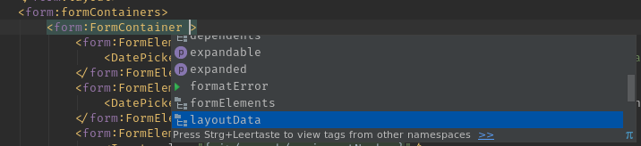

# UI5 Helper

This plugin adds some codeInsight and framework knowledge for Open- and SAPUI5 to IDEA IDEs.
It does not do much in its current state, it is not "production ready" and it will not save your time for
now.

### Some features that might be useful

#### Completion in XMLView
It can show you possible values for properties,

or existing event handler on the controller, 
 

the properties, aggregations and events available on a control,

or even the controls and aggreagtions valid in the current context.

### Things it may be able to do now (experimental):

 - XMLView: Go To Controller
 - Controller: Go To (XML)View
 - collapse the controller name in XMLViews
 - complete target names in manifest.json
 - Provide API Docs in XMLView
 - References to event handler implementation in XMLViews

### Contribution welcome

If you have feature request, hit a bug, or the plugin just does not work for you: Please contact us. Either via [GitHub](https://github.com/UNIORG-Solutions/idea-ui5helper/issues/new) or by mail.
 